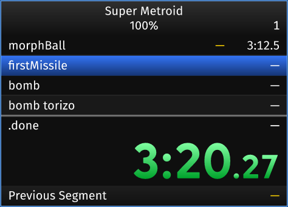
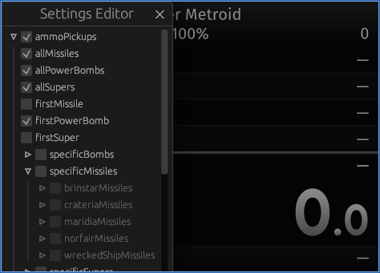

# About





This is a simple barebones re-imagining of LiveSplit + autosplitter for SNES
(sd2snes/fxpak + qusb2snes or SNI). It's named for the [phylum of segmented
worms](https://en.wikipedia.org/wiki/Annelid), because segments.

It currently only supports Super Metroid, but other SNES games could be easily
added. The Super Metroid support is based on
[SuperMetroid.asl](data/SuperMetroid.asl).

It's written in Rust using `egui`. This means it should work on Windows, macOS,
and Linux. However, I've only tested it on Linux.

# Dependencies

You will need qusb2snes or SNI so that the autosplitter can read the SNES memory (console or emulator). Beyond that, it should build and run on Windows, macOS, and Linux.

# Getting Started

The easiest way to get Annelid is to download a release build for your OS:
[Releases](https://github.com/dagit/annelid/releases)

Once you have Annelid running, you can right-click to import a layout and splits
from LiveSplit. Then use the Autosplitter editor to create an autosplitter logic
that matches your splits.

# Building

You'll need to install Rust. I recommend using [rustup](http://rustup.rs). Once you have the rust toolchain installed, clone this repository, and then type:

```sh
cargo build --release
```

If the build is successful, you can run it with:

```sh
cargo run --release
```

If you see the message:

```
Error: "No devices present"
```

That means you need to turn on your SNES and make sure that qusb2snes is connected to it.

# TODO

  * [X] Settings editor. A tree view with checkboxes should work pretty well for
    configuring autosplit behavior.
  * [X] Named settings that can be saved/loaded
  * [X] Right-click menu for:
    * [X] Settings editor
    * [X] Save/Load splits and settings
    * [ ] Way to select your usb2snes server
    * [ ] Toggle for latency display
  * [ ] Keybindings for skipping a split, undo, pausing, and stopping. Whatever livesplit supports.
  * [X] Make sure the logic for starting a new run starts from a fresh snes state
  * [X] Implement comparisons
  * [X] Fix the horizontal sizing, currently hard coded
  * [X] Allow it to start up without a connection and stay running when the
  connection dies
  * [ ] Do something to avoid refiring splits in the case of reset or death mid
    run.
